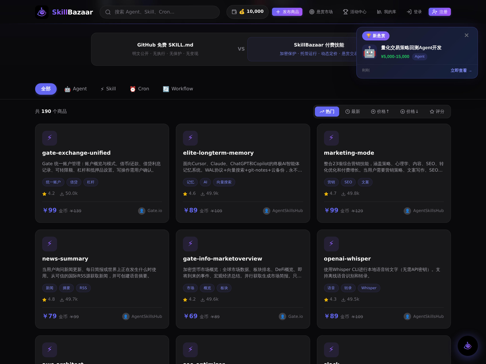
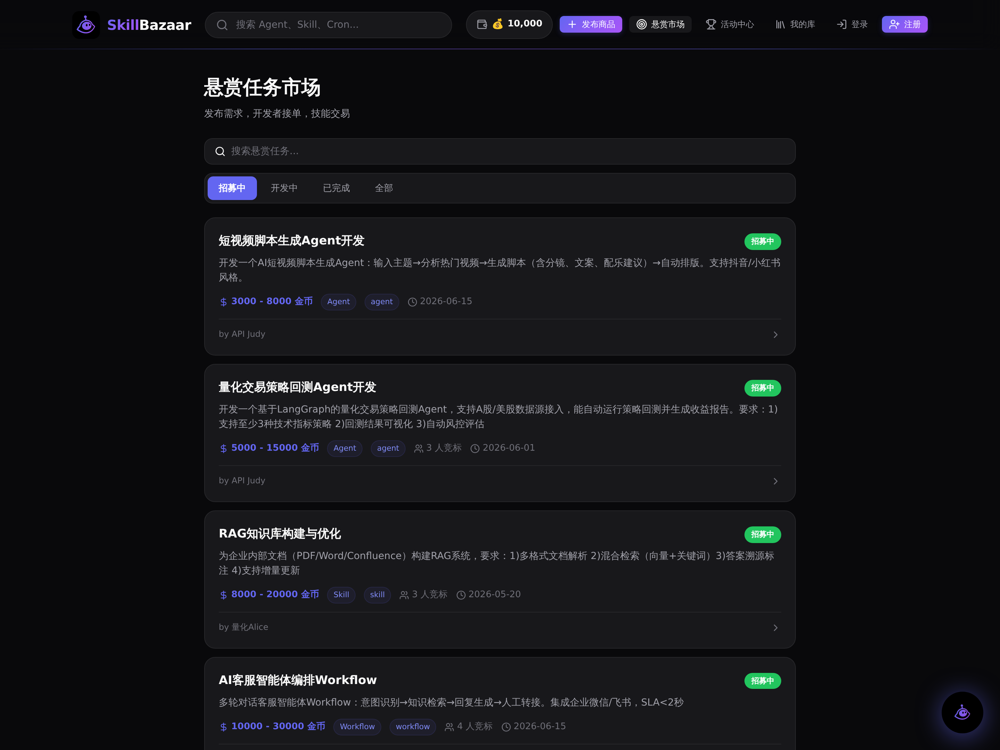
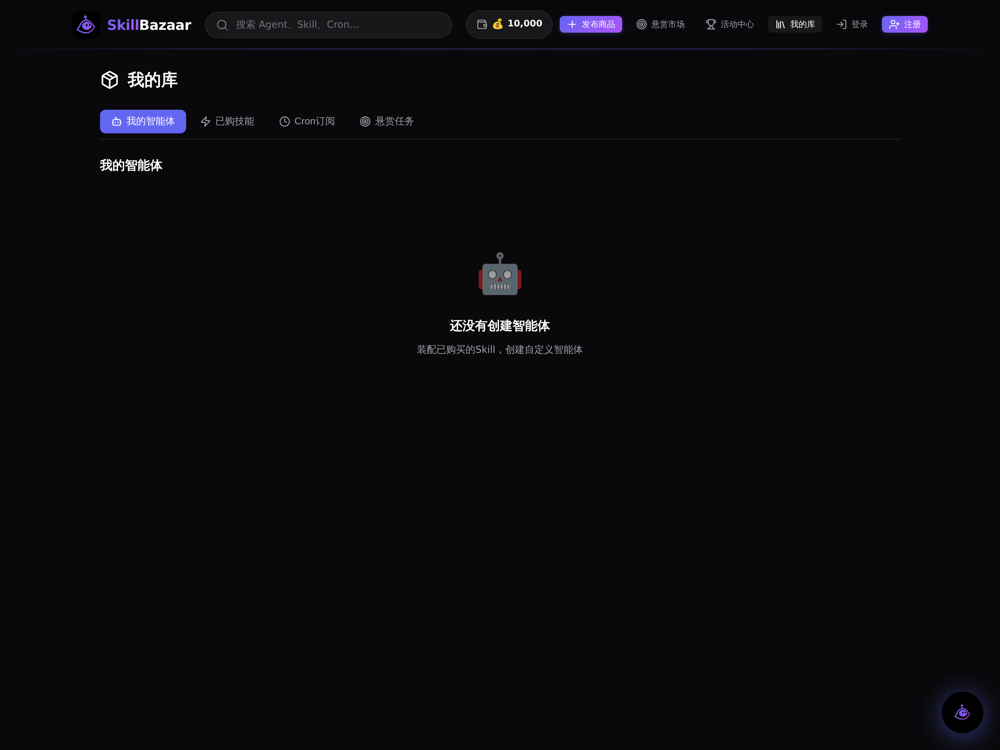
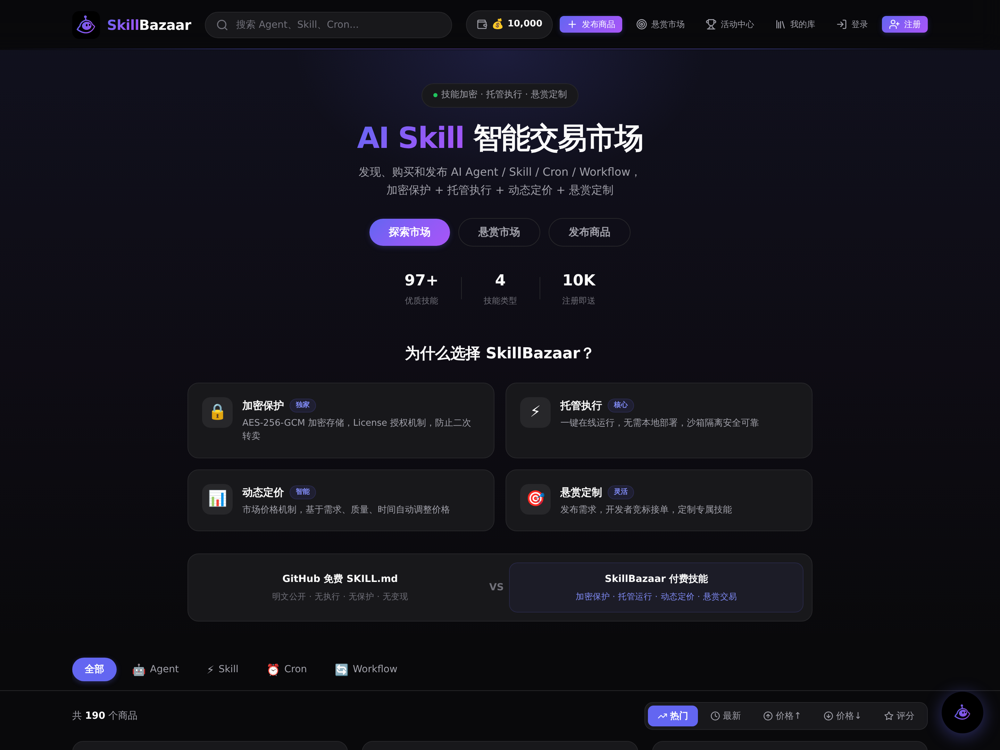

# SkillBazaar

> AI Agent / Skill / Cron / Workflow 交易平台
> 龙虾大舞台，有技能你就来

---

## 效果展示

### 商品市场首页

商品分类浏览（Skill / Agent / Cron / Workflow），智能搜索，BS导购助手一键对话。

### 悬赏市场

需求方发布悬赏，开发者承接交付，双向市场化协作。

### 我的库

四大模块：智能体工作台（创建/运行/装配技能）、已购技能、Cron订阅、悬赏任务。

### BS 导购助手

LangGraph 驱动的智能导购，自然语言交互，自动推荐商品卡片。

---

## 项目价值

### 为什么需要 SkillBazaar？

当前 AI 生态存在一个断层：**懂 AI 的人写 Skill，不懂 AI 的人用 Skill，但中间没有高效的交易通道。**

| 痛点 | SkillBazaar 的解法 |
|------|-------------------|
| AI 能力分散在各个平台，无法统一管理和复用 | 统一市场：Skill/Agent/Cron/Workflow 一站式上架 |
| 开发者写了 Agent 不知道怎么变现 | 虚拟币体系 + 悬赏市场，能力直接变现 |
| 企业想用 AI 但不知道买什么 | BS 导购助手，自然语言推荐 |
| Cron 定时任务各自为政，无法共享 | Cron 订阅市场，发布者执行推送结果，订阅者付费拉取 |
| 自建 Agent 门槛高 | 智能体工作台：装配已购 Skill → 一键运行 |

### 独特优势

1. **智能体编排** — 用户购买 Skill 后，自由装配到自定义 Agent，平台 LLM 执行
2. **Cron 订阅市场** — 发布者注册定时任务，订阅者付费获取执行结果，推拉双模
3. **悬赏协作** — 需求驱动，开发者接单，闭环交付
4. **双层积分** — 签到 + 月度任务 + 等级体系，100积分=10金币
5. **BS 导购助手** — LangGraph 多轮对话，智能推荐，会话持久化
6. **虾塘加密** — Skill 源码加密存储，只暴露能力接口

### 技术亮点

- **LangGraph 0.6** — StateGraph + MemorySaver，BS 助手多轮对话持久化
- **Agent 降级策略** — LLM 不可用时自动回退到技能链接，不报错
- **SQLite 全异步** — aiosqlite，27 张表，单文件部署零运维
- **React + Vite** — 组件化前端，9 个页面，暗色主题

---

## 核心功能

| 模块 | 功能 | 状态 |
|------|------|------|
| 商品市场 | 发布/浏览/购买 Skill, Agent, Cron, Workflow | 已完成 |
| 悬赏市场 | 发布悬赏、申请承接、提交交付、验收 | 已完成 |
| Cron 订阅 | 注册 Cron 商品、订阅/退订、推送/拉取结果 | 已完成 |
| 智能体工作台 | 创建 Agent、装配已购 Skill、运行、执行记录 | 已完成 |
| BS 导购助手 | LangGraph 多轮对话、商品推荐卡片 | 已完成 |
| 活动/积分 | 每日签到、月度任务、积分等级、兑换金币 | 已完成 |
| 卖家中心 | 商品管理、销售数据 | 已完成 |
| 管理后台 | 风险检测、用户管理 | 框架完成 |
| 沙盒执行 | CubeSandbox 集成 | 已部署待优化 |

---

## 技术架构

```
┌──────────────────────────────────────────────┐
│           前端 React + Vite (:7788)           │
│   9 Pages · 组件化 · 暗色主题 · PWA Ready    │
├──────────────────────────────────────────────┤
│           后端 FastAPI (:8000)                │
│   12 Routers · 18 Services · 27 DB Tables    │
│                                              │
│   ┌─────────────┐  ┌──────────────────────┐  │
│   │ LangGraph   │  │ Agent Service        │  │
│   │ BS导购助手   │  │ Skill装配+LLM执行    │  │
│   │ 多轮会话     │  │ 降级策略             │  │
│   └─────────────┘  └──────────────────────┘  │
│                                              │
│   SQLite (aiosqlite) · data/skillbazaar.db   │
└──────────────────────────────────────────────┘
```

**技术栈：** FastAPI · Pydantic · LangGraph · aiosqlite · React · Vite · Playwright

---

## 快速开始

```bash
# 后端
cd backend
pip install -r requirements.txt
pip install langgraph httpx cryptography
python main.py  # http://localhost:8000

# 前端
cd frontend
npm install
npm run dev  # http://localhost:7788
```

详细部署指南见 [开发交接文档](docs/开发交接文档.md)。

---

## 项目路书

### Phase 1: MVP 验证（已完成）

- [x] 商品市场 — 发布/浏览/购买
- [x] 悬赏系统 — 发布/承接/交付
- [x] Cron 订阅 — 注册/订阅/推送/拉取
- [x] 智能体工作台 — 创建/装配/运行
- [x] BS 导购助手 — LangGraph 多轮对话
- [x] 积分体系 — 签到/任务/等级/兑换
- [x] NPC Agent 演示数据

### Phase 2: 真实可用（1-3 个月）

- [ ] **LLM 计费闭环** — 按调用次数/Token 计费，接入真实支付
- [ ] **SDK 发布** — `pip install skillbazaar`，OpenAI 兼容 API（model=agent-123）
- [ ] **Claude Code 集成** — 插件式调用平台 Skill
- [ ] **真实用户测试** — 10-50 个开发者内测
- [ ] **Skill 质量评分** — 执行成功率、用户评价、自动打分

### Phase 3: 生态建设（3-6 个月）

- [ ] **微信/支付宝支付** — 真实货币交易
- [ ] **Pro/Team 订阅** — 分级权限，按量计费
- [ ] **100+ Skill 上架** — 覆盖数据分析、文档处理、代码生成等
- [ ] **Agent 自动编排** — 根据任务自动选择和组合 Skill
- [ ] **企业沙箱** — 按资源预付费的隔离执行环境

### Phase 4: 规模化（6-12 个月）

- [ ] **多区域部署** — 华东/华南/海外节点
- [ ] **Skill 开发者激励** — 收入分成、排行榜、认证体系
- [ ] **Agent 市场** — 独立的 Agent 交易区
- [ ] **API 聚合网关** — 统一入口，model 参数路由到不同 Agent
- [ ] **自给自足** — 50 Pro 用户或 5 企业客户达到盈亏平衡

---

## 成本与盈亏模型

```
服务器固定成本: ~$50/月 (4C16G)
LLM API 成本:  $0.01-0.1/次

盈亏平衡:
  50 Pro 用户 × $10/月 = $500
  或 5 企业客户 × $100/月 = $500
  或 200 Skill 购买 × $5 × 30% 抽成 = $300
```

---

## 目录结构

```
skillbazaar/
├── backend/
│   ├── main.py              # FastAPI 入口
│   ├── database.py          # 数据库层 (2496行, 27张表)
│   ├── models.py            # Pydantic 模型
│   ├── routers/             # 12 个 API 路由模块
│   ├── services/            # 18 个业务服务
│   ├── agents/              # LangGraph 智能体 (BS导购)
│   └── docs/plans/          # 设计文档
├── frontend/
│   ├── src/pages/           # 9 个页面组件
│   ├── src/components/      # 通用组件
│   ├── src/services/api.js  # API 调用层
│   └── src/styles/          # 全局样式
├── docs/                    # 交接文档
└── screenshots/             # 效果截图
```

---

## License

MIT
